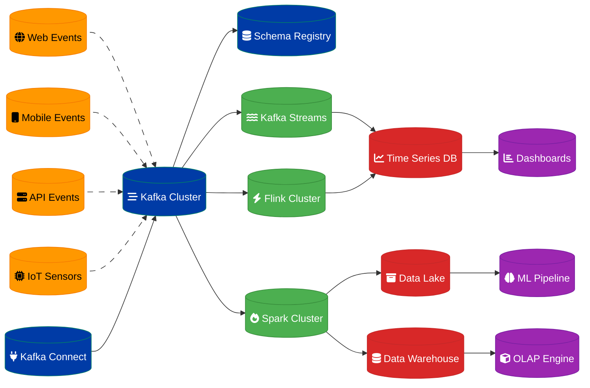

# Analytics Pipeline Design

## Overview

A horizontally scalable analytics pipeline aggregating user behavior data from 100+ million events daily, providing real-time insights and batch processing capabilities.

## Architecture Components

### Data Ingestion Layer
- **Apache Kafka**: High-throughput event streaming
- **Schema Registry**: Event schema management and evolution
- **Kafka Connect**: Source system integration
- **Stream Processors**: Real-time data transformation

### Processing Layer
- **Apache Spark**: Large-scale batch processing
- **Kafka Streams**: Real-time stream processing
- **Apache Flink**: Low-latency event processing
- **Data Quality**: Validation and cleansing

### Storage Layer
- **Data Lake**: Raw event storage (S3/HDFS)
- **Data Warehouse**: Structured analytics data
- **OLAP Cubes**: Pre-aggregated metrics
- **Time Series DB**: Real-time metrics storage

## Data Flow Architecture



## Event Schema Design

### User Behavior Events
```json
{
  "event_id": "uuid",
  "user_id": "string",
  "session_id": "string",
  "event_type": "page_view|click|purchase|signup",
  "timestamp": "iso8601",
  "properties": {
    "page_url": "string",
    "referrer": "string",
    "user_agent": "string",
    "device_type": "mobile|desktop|tablet",
    "location": {
      "country": "string",
      "region": "string",
      "city": "string"
    }
  },
  "context": {
    "app_version": "string",
    "platform": "web|ios|android",
    "screen_resolution": "string"
  }
}
```

### E-commerce Events
```json
{
  "event_id": "uuid",
  "user_id": "string",
  "event_type": "product_view|add_to_cart|purchase|refund",
  "timestamp": "iso8601",
  "properties": {
    "product_id": "string",
    "category": "string",
    "price": "decimal",
    "quantity": "integer",
    "currency": "string",
    "discount_code": "string"
  },
  "transaction": {
    "order_id": "string",
    "total_amount": "decimal",
    "payment_method": "string"
  }
}
```

## Real-Time Processing

### Kafka Streams Implementation
```java
public class UserBehaviorProcessor {
    public Topology buildTopology() {
        StreamsBuilder builder = new StreamsBuilder();
        
        // Input stream
        KStream<String, UserEvent> events = builder.stream("user-events");
        
        // Real-time aggregations
        KTable<Windowed<String>, Long> pageViewCounts = events
            .filter((key, event) -> "page_view".equals(event.getEventType()))
            .groupBy((key, event) -> event.getPageUrl())
            .windowedBy(TimeWindows.of(Duration.ofMinutes(5)))
            .count();
        
        // Session analysis
        KTable<Windowed<String>, SessionMetrics> sessionMetrics = events
            .groupByKey()
            .windowedBy(SessionWindows.with(Duration.ofMinutes(30)))
            .aggregate(
                SessionMetrics::new,
                (key, event, metrics) -> metrics.addEvent(event),
                Materialized.with(Serdes.String(), sessionMetricsSerde)
            );
        
        // Output to downstream topics
        pageViewCounts.toStream().to("page-view-counts");
        sessionMetrics.toStream().to("session-metrics");
        
        return builder.build();
    }
}
```

### Apache Flink Processing
```java
public class RealTimeAnalytics {
    public static void main(String[] args) throws Exception {
        StreamExecutionEnvironment env = StreamExecutionEnvironment.getExecutionEnvironment();
        
        // Configure checkpointing
        env.enableCheckpointing(60000);
        env.getCheckpointConfig().setCheckpointingMode(CheckpointingMode.EXACTLY_ONCE);
        
        // Kafka source
        FlinkKafkaConsumer<UserEvent> source = new FlinkKafkaConsumer<>(
            "user-events",
            new UserEventDeserializer(),
            kafkaProps
        );
        
        DataStream<UserEvent> events = env.addSource(source);
        
        // Real-time metrics
        DataStream<Tuple2<String, Long>> conversionRates = events
            .filter(event -> Arrays.asList("page_view", "purchase").contains(event.getEventType()))
            .keyBy(UserEvent::getUserId)
            .window(TumblingEventTimeWindows.of(Time.minutes(5)))
            .apply(new ConversionRateCalculator());
        
        // Anomaly detection
        DataStream<Alert> anomalies = events
            .keyBy(UserEvent::getEventType)
            .window(SlidingEventTimeWindows.of(Time.minutes(10), Time.minutes(1)))
            .apply(new AnomalyDetector());
        
        // Output sinks
        conversionRates.addSink(new FlinkKafkaProducer<>("conversion-rates", new TupleSerializer(), kafkaProps));
        anomalies.addSink(new AlertSink());
        
        env.execute("Real-Time Analytics Pipeline");
    }
}
```

## Batch Processing

### Apache Spark ETL Jobs
```python
from pyspark.sql import SparkSession
from pyspark.sql.functions import *
from pyspark.sql.types import *

class DailyETLJob:
    def __init__(self):
        self.spark = SparkSession.builder \
            .appName("Daily User Analytics ETL") \
            .config("spark.sql.adaptive.enabled", "true") \
            .config("spark.sql.adaptive.coalescePartitions.enabled", "true") \
            .getOrCreate()
    
    def process_daily_events(self, date):
        # Read raw events from data lake
        events_df = self.spark.read.parquet(f"s3://data-lake/events/date={date}")
        
        # Data quality checks
        clean_events = events_df.filter(
            col("user_id").isNotNull() &
            col("timestamp").isNotNull() &
            col("event_type").isin(["page_view", "click", "purchase", "signup"])
        )
        
        # User session aggregation
        user_sessions = clean_events.groupBy("user_id", "session_id").agg(
            min("timestamp").alias("session_start"),
            max("timestamp").alias("session_end"),
            count("*").alias("event_count"),
            countDistinct("page_url").alias("unique_pages"),
            sum(when(col("event_type") == "purchase", col("properties.price")).otherwise(0)).alias("revenue")
        ).withColumn("session_duration", 
                    (col("session_end").cast("long") - col("session_start").cast("long")) / 60)
        
        # Daily user metrics
        daily_metrics = user_sessions.groupBy("user_id").agg(
            count("session_id").alias("session_count"),
            sum("event_count").alias("total_events"),
            sum("session_duration").alias("total_time_spent"),
            sum("revenue").alias("daily_revenue"),
            avg("session_duration").alias("avg_session_duration")
        ).withColumn("date", lit(date))
        
        # Write to data warehouse
        daily_metrics.write \
            .mode("overwrite") \
            .partitionBy("date") \
            .parquet("s3://data-warehouse/user_daily_metrics")
        
        # Update OLAP cubes
        self.update_olap_cubes(daily_metrics, date)
    
    def update_olap_cubes(self, metrics_df, date):
        # Geographic aggregations
        geo_metrics = metrics_df.join(
            self.spark.table("dim_users").select("user_id", "country", "region"),
            "user_id"
        ).groupBy("country", "region", "date").agg(
            sum("daily_revenue").alias("revenue"),
            count("user_id").alias("active_users"),
            avg("avg_session_duration").alias("avg_session_duration")
        )
        
        geo_metrics.write \
            .mode("append") \
            .insertInto("olap.geographic_metrics")
```

## Data Quality Framework

### Validation Rules
```python
class DataQualityValidator:
    def __init__(self):
        self.rules = [
            self.validate_required_fields,
            self.validate_data_types,
            self.validate_business_rules,
            self.validate_referential_integrity
        ]
    
    def validate_required_fields(self, df):
        required_fields = ["event_id", "user_id", "timestamp", "event_type"]
        
        for field in required_fields:
            null_count = df.filter(col(field).isNull()).count()
            if null_count > 0:
                raise DataQualityException(f"Field {field} has {null_count} null values")
    
    def validate_data_types(self, df):
        # Timestamp validation
        invalid_timestamps = df.filter(
            ~col("timestamp").rlike(r"^\d{4}-\d{2}-\d{2}T\d{2}:\d{2}:\d{2}")
        ).count()
        
        if invalid_timestamps > 0:
            raise DataQualityException(f"Found {invalid_timestamps} invalid timestamps")
    
    def validate_business_rules(self, df):
        # Revenue should be positive for purchase events
        invalid_purchases = df.filter(
            (col("event_type") == "purchase") & 
            (col("properties.price") <= 0)
        ).count()
        
        if invalid_purchases > 0:
            raise DataQualityException(f"Found {invalid_purchases} purchases with invalid price")
    
    def validate_referential_integrity(self, df):
        # Check if user_ids exist in user dimension
        orphaned_events = df.join(
            self.spark.table("dim_users"),
            "user_id",
            "left_anti"
        ).count()
        
        if orphaned_events > 0:
            logger.warning(f"Found {orphaned_events} events with unknown user_ids")
```

## Performance Optimization

### Partitioning Strategy
- **Time-based Partitioning**: Daily/hourly partitions for time-series data
- **Hash Partitioning**: User ID-based distribution for user analytics
- **Range Partitioning**: Geographic or categorical data distribution
- **Composite Partitioning**: Multi-dimensional partitioning schemes

### Caching Strategy
- **Hot Data Caching**: Frequently accessed aggregations in Redis
- **Query Result Caching**: Pre-computed dashboard queries
- **Materialized Views**: Pre-aggregated OLAP cubes
- **Columnar Storage**: Optimized storage formats (Parquet, ORC)

### Resource Management
- **Dynamic Scaling**: Auto-scaling based on workload
- **Resource Isolation**: Separate clusters for batch and streaming
- **Priority Queues**: Workload prioritization
- **Cost Optimization**: Spot instances and reserved capacity

## Monitoring & Observability

### Pipeline Metrics
- **Throughput**: Events processed per second
- **Latency**: End-to-end processing time
- **Error Rate**: Failed event percentage
- **Data Freshness**: Time lag from event to availability

### Data Quality Metrics
- **Completeness**: Missing data percentage
- **Accuracy**: Data validation failure rate
- **Consistency**: Cross-system data alignment
- **Timeliness**: Data arrival delay metrics

### Business Metrics
- **User Engagement**: Session duration, page views
- **Conversion Rates**: Funnel analysis metrics
- **Revenue Analytics**: Transaction and revenue trends
- **Cohort Analysis**: User retention and lifetime value

## Security & Compliance

### Data Privacy
- **PII Masking**: Personal data anonymization
- **GDPR Compliance**: Right to be forgotten implementation
- **Data Lineage**: Complete data flow tracking
- **Access Control**: Role-based data access

### Security Measures
- **Encryption**: Data at rest and in transit
- **Authentication**: Service-to-service authentication
- **Audit Logging**: Complete access audit trail
- **Network Security**: VPC and firewall configuration

## Implementation Timeline

### Phase 1: Foundation (Weeks 1-4)
1. Kafka cluster setup and configuration
2. Basic Spark ETL jobs
3. Data lake storage implementation
4. Schema registry setup

### Phase 2: Real-time Processing (Weeks 5-8)
1. Kafka Streams implementation
2. Flink cluster deployment
3. Real-time dashboard development
4. Alerting system setup

### Phase 3: Advanced Analytics (Weeks 9-12)
1. OLAP cube implementation
2. Machine learning pipeline
3. Advanced data quality framework
4. Performance optimization

### Phase 4: Production Ready (Weeks 13-16)
1. Security hardening
2. Disaster recovery setup
3. Comprehensive monitoring
4. Documentation and training

---
**Related ADR:** [ADR 0008: Analytics Pipeline](adr-0008-analytics-pipeline.md)
