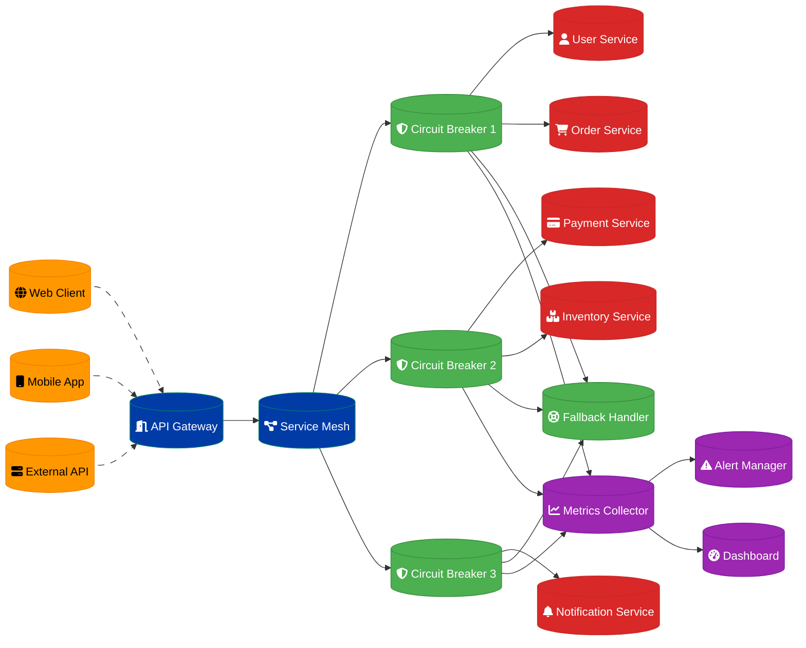

# Circuit Breaker Pattern Design

## Overview

A circuit breaker pattern implementation for a service mesh handling cascading failures across 50+ microservices, providing fault tolerance and system resilience.

## Architecture Components

### Circuit Breaker Core
- **State Machine**: Open/Closed/Half-Open state management
- **Failure Detection**: Error rate and latency monitoring
- **Recovery Logic**: Automatic service recovery detection
- **Configuration Management**: Dynamic threshold adjustment

### Service Mesh Integration
- **Istio Integration**: Envoy proxy circuit breaker configuration
- **Load Balancing**: Intelligent traffic routing
- **Health Checking**: Service health monitoring
- **Observability**: Distributed tracing and metrics

### Monitoring & Alerting
- **Real-time Metrics**: Circuit breaker state monitoring
- **Failure Analytics**: Root cause analysis
- **Performance Tracking**: Latency and throughput metrics
- **Alert Management**: Proactive failure notification

## Data Flow Architecture



## Circuit Breaker State Machine

### State Definitions
```python
from enum import Enum
from datetime import datetime, timedelta
import asyncio

class CircuitBreakerState(Enum):
    CLOSED = "closed"
    OPEN = "open"
    HALF_OPEN = "half_open"

class CircuitBreaker:
    def __init__(self, 
                 failure_threshold=5,
                 recovery_timeout=60,
                 expected_exception=Exception,
                 name="CircuitBreaker"):
        self.failure_threshold = failure_threshold
        self.recovery_timeout = recovery_timeout
        self.expected_exception = expected_exception
        self.name = name
        
        # State management
        self.state = CircuitBreakerState.CLOSED
        self.failure_count = 0
        self.last_failure_time = None
        self.success_count = 0
        
        # Metrics
        self.total_requests = 0
        self.total_failures = 0
        self.total_successes = 0
    
    async def call(self, func, *args, **kwargs):
        self.total_requests += 1
        
        if self.state == CircuitBreakerState.OPEN:
            if self._should_attempt_reset():
                self.state = CircuitBreakerState.HALF_OPEN
                self.success_count = 0
            else:
                raise CircuitBreakerOpenException(f"Circuit breaker {self.name} is OPEN")
        
        try:
            result = await func(*args, **kwargs)
            self._on_success()
            return result
            
        except self.expected_exception as e:
            self._on_failure()
            raise e
    
    def _on_success(self):
        self.total_successes += 1
        
        if self.state == CircuitBreakerState.HALF_OPEN:
            self.success_count += 1
            if self.success_count >= self.failure_threshold:
                self._reset()
        else:
            self.failure_count = 0
    
    def _on_failure(self):
        self.total_failures += 1
        self.failure_count += 1
        self.last_failure_time = datetime.now()
        
        if self.failure_count >= self.failure_threshold:
            self.state = CircuitBreakerState.OPEN
    
    def _should_attempt_reset(self):
        return (self.last_failure_time and 
                datetime.now() - self.last_failure_time >= timedelta(seconds=self.recovery_timeout))
    
    def _reset(self):
        self.state = CircuitBreakerState.CLOSED
        self.failure_count = 0
        self.success_count = 0
        self.last_failure_time = None
```

### Advanced Circuit Breaker
```python
class AdaptiveCircuitBreaker(CircuitBreaker):
    def __init__(self, *args, **kwargs):
        super().__init__(*args, **kwargs)
        self.request_volume_threshold = kwargs.get('request_volume_threshold', 20)
        self.error_percentage_threshold = kwargs.get('error_percentage_threshold', 50)
        self.sliding_window_size = kwargs.get('sliding_window_size', 60)
        
        # Sliding window for metrics
        self.request_window = []
        self.success_window = []
    
    def _should_trip(self):
        now = datetime.now()
        window_start = now - timedelta(seconds=self.sliding_window_size)
        
        # Clean old entries
        self.request_window = [t for t in self.request_window if t > window_start]
        self.success_window = [t for t in self.success_window if t > window_start]
        
        # Check volume threshold
        if len(self.request_window) < self.request_volume_threshold:
            return False
        
        # Check error percentage
        error_count = len(self.request_window) - len(self.success_window)
        error_percentage = (error_count / len(self.request_window)) * 100
        
        return error_percentage >= self.error_percentage_threshold
    
    async def call(self, func, *args, **kwargs):
        now = datetime.now()
        self.request_window.append(now)
        
        if self.state == CircuitBreakerState.OPEN:
            if self._should_attempt_reset():
                self.state = CircuitBreakerState.HALF_OPEN
            else:
                raise CircuitBreakerOpenException(f"Circuit breaker {self.name} is OPEN")
        
        try:
            result = await func(*args, **kwargs)
            self.success_window.append(now)
            self._on_success()
            return result
            
        except self.expected_exception as e:
            if self._should_trip():
                self.state = CircuitBreakerState.OPEN
                self.last_failure_time = now
            raise e
```

## Service Mesh Integration

### Istio Configuration
```yaml
apiVersion: networking.istio.io/v1beta1
kind: DestinationRule
metadata:
  name: payment-service-circuit-breaker
spec:
  host: payment-service
  trafficPolicy:
    outlierDetection:
      consecutiveGatewayErrors: 5
      consecutive5xxErrors: 5
      interval: 30s
      baseEjectionTime: 30s
      maxEjectionPercent: 50
      minHealthPercent: 30
    circuitBreaker:
      connectionPool:
        tcp:
          maxConnections: 100
        http:
          http1MaxPendingRequests: 50
          http2MaxRequests: 100
          maxRequestsPerConnection: 10
          maxRetries: 3
          consecutiveGatewayErrors: 5
          interval: 30s
          baseEjectionTime: 30s
```

### Envoy Circuit Breaker Configuration
```yaml
circuit_breakers:
  thresholds:
    - priority: DEFAULT
      max_connections: 1000
      max_pending_requests: 100
      max_requests: 1000
      max_retries: 3
      retry_budget:
        budget_percent:
          value: 25.0
        min_retry_concurrency: 3
    - priority: HIGH
      max_connections: 2000
      max_pending_requests: 200
      max_requests: 2000
      max_retries: 5
```

## Fallback Strategies

### Fallback Handler Implementation
```python
class FallbackHandler:
    def __init__(self):
        self.fallback_strategies = {
            'user-service': self.user_service_fallback,
            'payment-service': self.payment_service_fallback,
            'inventory-service': self.inventory_service_fallback,
            'notification-service': self.notification_service_fallback
        }
        self.cache = Redis()
    
    async def handle_fallback(self, service_name, operation, *args, **kwargs):
        strategy = self.fallback_strategies.get(service_name)
        if strategy:
            return await strategy(operation, *args, **kwargs)
        else:
            return await self.default_fallback(service_name, operation)
    
    async def user_service_fallback(self, operation, *args, **kwargs):
        if operation == 'get_user':
            # Return cached user data
            user_id = kwargs.get('user_id')
            cached_user = await self.cache.get(f"user:{user_id}")
            if cached_user:
                return json.loads(cached_user)
            else:
                # Return minimal user object
                return {"id": user_id, "name": "Unknown User", "status": "unavailable"}
        
        elif operation == 'authenticate':
            # Fail open for authentication during outage
            return {"authenticated": True, "user_id": "temp", "permissions": ["read"]}
    
    async def payment_service_fallback(self, operation, *args, **kwargs):
        if operation == 'process_payment':
            # Queue payment for later processing
            payment_data = kwargs
            await self.queue_payment_for_retry(payment_data)
            return {"status": "queued", "message": "Payment will be processed when service recovers"}
        
        elif operation == 'get_payment_status':
            # Return cached status or unknown
            return {"status": "unknown", "message": "Payment service temporarily unavailable"}
    
    async def inventory_service_fallback(self, operation, *args, **kwargs):
        if operation == 'check_availability':
            # Return cached inventory or assume available
            product_id = kwargs.get('product_id')
            cached_inventory = await self.cache.get(f"inventory:{product_id}")
            if cached_inventory:
                return json.loads(cached_inventory)
            else:
                # Optimistic availability
                return {"available": True, "quantity": 1, "source": "fallback"}
    
    async def notification_service_fallback(self, operation, *args, **kwargs):
        if operation == 'send_notification':
            # Queue notification for later delivery
            notification_data = kwargs
            await self.queue_notification_for_retry(notification_data)
            return {"status": "queued", "message": "Notification queued for delivery"}
    
    async def default_fallback(self, service_name, operation):
        return {
            "error": "Service unavailable",
            "service": service_name,
            "operation": operation,
            "fallback": True
        }
```

## Monitoring & Observability

### Metrics Collection
```python
class CircuitBreakerMetrics:
    def __init__(self, prometheus_client):
        self.prometheus = prometheus_client
        
        # Circuit breaker state gauge
        self.state_gauge = self.prometheus.Gauge(
            'circuit_breaker_state',
            'Current state of circuit breaker',
            ['service_name', 'state']
        )
        
        # Request counters
        self.request_counter = self.prometheus.Counter(
            'circuit_breaker_requests_total',
            'Total requests through circuit breaker',
            ['service_name', 'result']
        )
        
        # Failure rate gauge
        self.failure_rate_gauge = self.prometheus.Gauge(
            'circuit_breaker_failure_rate',
            'Current failure rate percentage',
            ['service_name']
        )
        
        # Response time histogram
        self.response_time_histogram = self.prometheus.Histogram(
            'circuit_breaker_response_time_seconds',
            'Response time distribution',
            ['service_name'],
            buckets=[0.1, 0.5, 1.0, 2.0, 5.0, 10.0]
        )
    
    def record_request(self, service_name, success, response_time):
        result = 'success' if success else 'failure'
        self.request_counter.labels(service_name=service_name, result=result).inc()
        self.response_time_histogram.labels(service_name=service_name).observe(response_time)
    
    def update_state(self, service_name, state):
        # Reset all state gauges for this service
        for s in ['closed', 'open', 'half_open']:
            self.state_gauge.labels(service_name=service_name, state=s).set(0)
        
        # Set current state
        self.state_gauge.labels(service_name=service_name, state=state.value).set(1)
    
    def update_failure_rate(self, service_name, failure_rate):
        self.failure_rate_gauge.labels(service_name=service_name).set(failure_rate)
```

### Alerting Rules
```yaml
groups:
  - name: circuit_breaker_alerts
    rules:
      - alert: CircuitBreakerOpen
        expr: circuit_breaker_state{state="open"} == 1
        for: 1m
        labels:
          severity: warning
        annotations:
          summary: "Circuit breaker is open for {{ $labels.service_name }}"
          description: "Circuit breaker for {{ $labels.service_name }} has been open for more than 1 minute"
      
      - alert: HighFailureRate
        expr: circuit_breaker_failure_rate > 25
        for: 5m
        labels:
          severity: warning
        annotations:
          summary: "High failure rate detected for {{ $labels.service_name }}"
          description: "Failure rate for {{ $labels.service_name }} is {{ $value }}% over the last 5 minutes"
      
      - alert: CircuitBreakerFlapping
        expr: changes(circuit_breaker_state[10m]) > 5
        for: 2m
        labels:
          severity: critical
        annotations:
          summary: "Circuit breaker flapping for {{ $labels.service_name }}"
          description: "Circuit breaker for {{ $labels.service_name }} has changed state {{ $value }} times in 10 minutes"
```

## Performance Optimization

### Async Circuit Breaker
```python
import asyncio
from typing import Callable, Any

class AsyncCircuitBreaker:
    def __init__(self, *args, **kwargs):
        super().__init__(*args, **kwargs)
        self._lock = asyncio.Lock()
        self._semaphore = asyncio.Semaphore(100)  # Limit concurrent requests
    
    async def call(self, func: Callable, *args, **kwargs) -> Any:
        async with self._semaphore:
            async with self._lock:
                if self.state == CircuitBreakerState.OPEN:
                    if not self._should_attempt_reset():
                        raise CircuitBreakerOpenException(f"Circuit breaker {self.name} is OPEN")
                    self.state = CircuitBreakerState.HALF_OPEN
            
            start_time = asyncio.get_event_loop().time()
            
            try:
                result = await asyncio.wait_for(
                    func(*args, **kwargs),
                    timeout=self.timeout
                )
                
                response_time = asyncio.get_event_loop().time() - start_time
                await self._on_success(response_time)
                return result
                
            except asyncio.TimeoutError:
                await self._on_failure('timeout')
                raise
            except Exception as e:
                await self._on_failure('error')
                raise
```

## Testing Strategy

### Circuit Breaker Testing
```python
import pytest
import asyncio
from unittest.mock import AsyncMock

class TestCircuitBreaker:
    @pytest.fixture
    def circuit_breaker(self):
        return CircuitBreaker(
            failure_threshold=3,
            recovery_timeout=5,
            name="test-breaker"
        )
    
    @pytest.mark.asyncio
    async def test_closed_state_allows_requests(self, circuit_breaker):
        mock_func = AsyncMock(return_value="success")
        
        result = await circuit_breaker.call(mock_func)
        
        assert result == "success"
        assert circuit_breaker.state == CircuitBreakerState.CLOSED
        mock_func.assert_called_once()
    
    @pytest.mark.asyncio
    async def test_opens_after_threshold_failures(self, circuit_breaker):
        mock_func = AsyncMock(side_effect=Exception("Service error"))
        
        # Trigger failures up to threshold
        for _ in range(3):
            with pytest.raises(Exception):
                await circuit_breaker.call(mock_func)
        
        assert circuit_breaker.state == CircuitBreakerState.OPEN
    
    @pytest.mark.asyncio
    async def test_half_open_recovery(self, circuit_breaker):
        # Force circuit breaker to open state
        circuit_breaker.state = CircuitBreakerState.OPEN
        circuit_breaker.last_failure_time = datetime.now() - timedelta(seconds=10)
        
        mock_func = AsyncMock(return_value="success")
        
        # Should transition to half-open and succeed
        result = await circuit_breaker.call(mock_func)
        
        assert result == "success"
        assert circuit_breaker.state == CircuitBreakerState.HALF_OPEN
```

## Implementation Timeline

### Phase 1: Core Implementation (Weeks 1-3)
1. Basic circuit breaker state machine
2. Simple failure detection
3. Fallback mechanism implementation
4. Unit testing

### Phase 2: Service Mesh Integration (Weeks 4-6)
1. Istio/Envoy configuration
2. Service discovery integration
3. Load balancing configuration
4. Integration testing

### Phase 3: Advanced Features (Weeks 7-9)
1. Adaptive thresholds
2. Advanced metrics collection
3. Comprehensive monitoring
4. Performance optimization

### Phase 4: Production Ready (Weeks 10-12)
1. Chaos engineering testing
2. Performance benchmarking
3. Documentation and runbooks
4. Team training

---
**Related ADR:** [ADR 0009: Circuit Breaker Pattern](docs/adr-0009-circuit-breaker-pattern.md)
