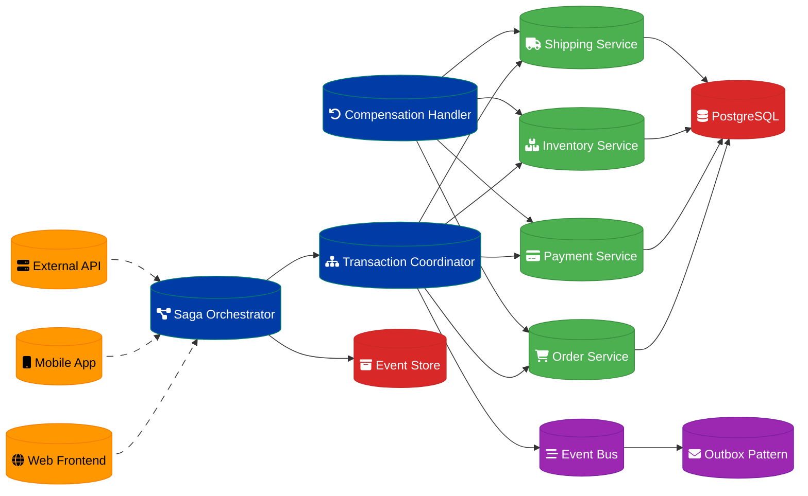

# Data Consistency Layer Design

## Overview

A data consistency layer for order processing across payment, inventory, and shipping microservices, ensuring ACID properties and handling distributed transaction challenges.

## Architecture Components

### Transaction Coordinator
- **Saga Orchestrator**: Distributed transaction management
- **Two-Phase Commit**: Strong consistency protocol
- **Compensation Handler**: Rollback operation management
- **State Machine**: Transaction lifecycle management

### Event Sourcing
- **Event Store**: Immutable event log
- **Event Replay**: State reconstruction capability
- **Snapshot Management**: Performance optimization
- **Event Versioning**: Schema evolution support

### Microservice Integration
- **Payment Service**: Transaction processing and validation
- **Inventory Service**: Stock management and reservation
- **Shipping Service**: Fulfillment and tracking
- **Order Service**: Order lifecycle management

## Data Flow Architecture



## Saga Pattern Implementation

### Orchestration-Based Saga
```python
class OrderSaga:
    def __init__(self):
        self.state_machine = {
            'STARTED': self.reserve_inventory,
            'INVENTORY_RESERVED': self.process_payment,
            'PAYMENT_PROCESSED': self.create_shipment,
            'SHIPMENT_CREATED': self.complete_order,
            'COMPLETED': None
        }
        self.compensations = {
            'INVENTORY_RESERVED': self.release_inventory,
            'PAYMENT_PROCESSED': self.refund_payment,
            'SHIPMENT_CREATED': self.cancel_shipment
        }
    
    async def execute(self, order_data):
        saga_id = generate_saga_id()
        current_state = 'STARTED'
        
        try:
            while current_state != 'COMPLETED':
                handler = self.state_machine[current_state]
                result = await handler(saga_id, order_data)
                current_state = result.next_state
                
                # Persist saga state
                await self.persist_saga_state(saga_id, current_state, result.data)
                
        except Exception as e:
            await self.compensate(saga_id, current_state)
            raise SagaFailedException(f"Saga {saga_id} failed: {e}")
    
    async def compensate(self, saga_id, failed_state):
        # Execute compensations in reverse order
        states_to_compensate = self.get_completed_states(saga_id, failed_state)
        
        for state in reversed(states_to_compensate):
            compensation = self.compensations.get(state)
            if compensation:
                await compensation(saga_id)
```

### Choreography-Based Saga
```python
class OrderEventHandler:
    async def handle_order_created(self, event):
        try:
            # Reserve inventory
            result = await inventory_service.reserve(
                event.order_id, 
                event.items
            )
            
            if result.success:
                await self.publish_event('InventoryReserved', {
                    'order_id': event.order_id,
                    'reservation_id': result.reservation_id
                })
            else:
                await self.publish_event('OrderFailed', {
                    'order_id': event.order_id,
                    'reason': 'Insufficient inventory'
                })
        except Exception as e:
            await self.publish_event('OrderFailed', {
                'order_id': event.order_id,
                'reason': str(e)
            })
    
    async def handle_inventory_reserved(self, event):
        # Process payment
        result = await payment_service.charge(
            event.order_id,
            event.amount
        )
        
        if result.success:
            await self.publish_event('PaymentProcessed', event)
        else:
            # Compensate inventory reservation
            await inventory_service.release(event.reservation_id)
            await self.publish_event('OrderFailed', event)
```

## Event Sourcing Architecture

### Event Store Design
```python
class EventStore:
    def __init__(self):
        self.events = []  # In practice, this would be a database
    
    async def append_events(self, stream_id, expected_version, events):
        # Optimistic concurrency control
        current_version = await self.get_stream_version(stream_id)
        
        if current_version != expected_version:
            raise ConcurrencyException(
                f"Expected version {expected_version}, got {current_version}"
            )
        
        # Append events atomically
        for i, event in enumerate(events):
            event.version = current_version + i + 1
            event.stream_id = stream_id
            event.timestamp = datetime.utcnow()
            
        await self.persist_events(events)
        
        # Publish events to event bus
        await self.publish_events(events)
    
    async def get_events(self, stream_id, from_version=0):
        return await self.query_events(
            stream_id=stream_id,
            version_gte=from_version
        )
```

### Aggregate Reconstruction
```python
class OrderAggregate:
    def __init__(self):
        self.id = None
        self.status = 'PENDING'
        self.items = []
        self.total_amount = 0
        self.version = 0
    
    @classmethod
    async def load_from_events(cls, stream_id, event_store):
        aggregate = cls()
        events = await event_store.get_events(stream_id)
        
        for event in events:
            aggregate.apply_event(event)
            aggregate.version = event.version
        
        return aggregate
    
    def apply_event(self, event):
        if event.type == 'OrderCreated':
            self.id = event.data['order_id']
            self.items = event.data['items']
            self.total_amount = event.data['total_amount']
        elif event.type == 'PaymentProcessed':
            self.status = 'PAID'
        elif event.type == 'OrderShipped':
            self.status = 'SHIPPED'
        elif event.type == 'OrderCancelled':
            self.status = 'CANCELLED'
```

## Two-Phase Commit Protocol

### Coordinator Implementation
```python
class TwoPhaseCommitCoordinator:
    async def execute_transaction(self, transaction_id, participants):
        # Phase 1: Prepare
        prepare_results = []
        
        for participant in participants:
            try:
                result = await participant.prepare(transaction_id)
                prepare_results.append((participant, result))
            except Exception as e:
                # Abort transaction
                await self.abort_transaction(transaction_id, prepare_results)
                raise TransactionAbortedException(f"Prepare failed: {e}")
        
        # Check if all participants are prepared
        if all(result.prepared for _, result in prepare_results):
            # Phase 2: Commit
            await self.commit_transaction(transaction_id, participants)
        else:
            # Abort transaction
            await self.abort_transaction(transaction_id, prepare_results)
    
    async def commit_transaction(self, transaction_id, participants):
        for participant in participants:
            try:
                await participant.commit(transaction_id)
            except Exception as e:
                # Log error but continue - participant must handle recovery
                logger.error(f"Commit failed for {participant}: {e}")
    
    async def abort_transaction(self, transaction_id, prepared_participants):
        for participant, result in prepared_participants:
            if result.prepared:
                try:
                    await participant.abort(transaction_id)
                except Exception as e:
                    logger.error(f"Abort failed for {participant}: {e}")
```

## Outbox Pattern

### Transactional Outbox
```python
class OutboxPattern:
    async def save_and_publish(self, aggregate_changes, events):
        async with database.transaction():
            # Save aggregate changes
            await self.save_aggregate(aggregate_changes)
            
            # Save events to outbox table
            for event in events:
                await self.save_to_outbox(event)
        
        # Publish events asynchronously
        await self.publish_outbox_events()
    
    async def save_to_outbox(self, event):
        await database.execute("""
            INSERT INTO outbox_events (
                id, aggregate_id, event_type, event_data, created_at
            ) VALUES (?, ?, ?, ?, ?)
        """, [
            event.id,
            event.aggregate_id,
            event.type,
            json.dumps(event.data),
            datetime.utcnow()
        ])
    
    async def publish_outbox_events(self):
        unpublished_events = await database.query("""
            SELECT * FROM outbox_events 
            WHERE published = false 
            ORDER BY created_at
        """)
        
        for event_row in unpublished_events:
            try:
                await event_bus.publish(event_row.to_event())
                
                # Mark as published
                await database.execute("""
                    UPDATE outbox_events 
                    SET published = true 
                    WHERE id = ?
                """, [event_row.id])
                
            except Exception as e:
                logger.error(f"Failed to publish event {event_row.id}: {e}")
```

## Consistency Guarantees

### Strong Consistency
- **ACID Transactions**: Database-level consistency
- **Two-Phase Commit**: Distributed transaction consistency
- **Synchronous Replication**: Real-time data synchronization
- **Pessimistic Locking**: Conflict prevention

### Eventual Consistency
- **Saga Pattern**: Long-running transaction consistency
- **Event Sourcing**: Event-driven state consistency
- **Asynchronous Messaging**: Eventual state convergence
- **Compensation**: Error recovery and rollback

### Consistency Levels
- **Immediate**: Real-time consistency requirements
- **Session**: Per-session consistency guarantees
- **Monotonic**: Non-decreasing consistency
- **Causal**: Cause-effect relationship preservation

## Error Handling & Recovery

### Failure Scenarios
- **Network Partitions**: Service communication failures
- **Service Timeouts**: Slow response handling
- **Data Corruption**: Invalid state detection
- **Concurrent Updates**: Optimistic locking conflicts

### Recovery Strategies
- **Automatic Retry**: Transient failure recovery
- **Circuit Breaker**: Cascade failure prevention
- **Compensation**: Business logic rollback
- **Manual Intervention**: Complex failure resolution

### Monitoring & Alerting
- **Transaction Metrics**: Success/failure rates
- **Latency Monitoring**: End-to-end timing
- **Consistency Checks**: Data integrity validation
- **Error Tracking**: Failure pattern analysis

## Performance Optimization

### Throughput Enhancement
- **Parallel Processing**: Concurrent transaction execution
- **Batch Operations**: Bulk data processing
- **Connection Pooling**: Resource optimization
- **Caching**: Frequently accessed data

### Latency Reduction
- **Async Processing**: Non-blocking operations
- **Local Caching**: Fast data access
- **Read Replicas**: Query load distribution
- **Precomputation**: Calculated results caching

## Implementation Timeline

### Phase 1: Foundation (Weeks 1-4)
1. Event store implementation
2. Basic saga orchestrator
3. Outbox pattern setup
4. Core microservice integration

### Phase 2: Advanced Patterns (Weeks 5-8)
1. Two-phase commit protocol
2. Compensation mechanisms
3. Event sourcing optimization
4. Consistency monitoring

### Phase 3: Production Ready (Weeks 9-12)
1. Performance optimization
2. Error handling enhancement
3. Monitoring and alerting
4. Load testing and tuning

---
**Related ADR:** [ADR 0007: Data Consistency Layer](adr-0007-data-consistency-layer.md)
