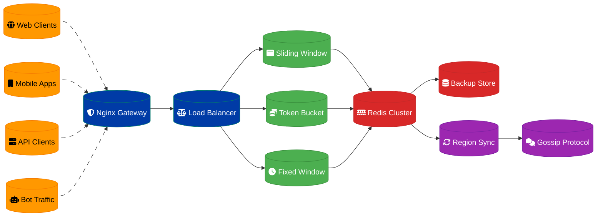

# Distributed Rate Limiting System Design

## Overview

A distributed rate limiting system protecting APIs from 1 million requests per second across multiple regions, providing consistent rate enforcement and DDoS protection.

## Architecture Components

### Rate Limiting Core
- **Sliding Window Counter**: Precise rate calculation algorithm
- **Token Bucket**: Burst traffic handling
- **Fixed Window**: Simple time-based limiting
- **Distributed Counter**: Cross-region rate synchronization

### Storage Layer
- **Redis Cluster**: High-performance rate counter storage
- **Consistent Hashing**: Distributed key management
- **Replication**: Multi-region data synchronization
- **Persistence**: Rate limit state durability

### API Gateway Integration
- **Nginx Modules**: High-performance request filtering
- **Middleware**: Application-level rate limiting
- **Edge Processing**: CDN-based rate enforcement
- **Circuit Breakers**: Overload protection

## Data Flow Architecture



## Rate Limiting Algorithms

### Sliding Window Counter
```python
def sliding_window_check(key, limit, window_size):
    now = time.time()
    pipeline = redis.pipeline()
    
    # Remove expired entries
    pipeline.zremrangebyscore(key, 0, now - window_size)
    
    # Count current requests
    pipeline.zcard(key)
    
    # Add current request
    pipeline.zadd(key, {str(uuid.uuid4()): now})
    
    # Set expiration
    pipeline.expire(key, window_size)
    
    results = pipeline.execute()
    current_count = results[1]
    
    return current_count < limit
```

### Token Bucket Algorithm
```python
def token_bucket_check(key, capacity, refill_rate):
    now = time.time()
    bucket = redis.hmget(key, 'tokens', 'last_refill')
    
    if bucket[0] is None:
        # Initialize bucket
        redis.hmset(key, {
            'tokens': capacity,
            'last_refill': now
        })
        return True
    
    tokens = float(bucket[0])
    last_refill = float(bucket[1])
    
    # Calculate tokens to add
    time_passed = now - last_refill
    tokens_to_add = time_passed * refill_rate
    tokens = min(capacity, tokens + tokens_to_add)
    
    if tokens >= 1:
        tokens -= 1
        redis.hmset(key, {
            'tokens': tokens,
            'last_refill': now
        })
        return True
    
    return False
```

### Fixed Window Counter
```python
def fixed_window_check(key, limit, window_size):
    now = time.time()
    window = int(now // window_size)
    window_key = f"{key}:{window}"
    
    current_count = redis.incr(window_key)
    redis.expire(window_key, window_size)
    
    return current_count <= limit
```

## Multi-Region Synchronization

### Gossip Protocol
- **Peer Discovery**: Automatic node discovery
- **State Propagation**: Rate limit state sharing
- **Conflict Resolution**: Consistent state management
- **Failure Detection**: Node health monitoring

### Eventual Consistency
- **Local Decisions**: Fast local rate limiting
- **Global Convergence**: Cross-region state sync
- **Conflict Resolution**: Last-writer-wins strategy
- **Compensation**: Retroactive rate adjustments

### Synchronization Strategies
- **Push-based**: Proactive state broadcasting
- **Pull-based**: Periodic state fetching
- **Hybrid**: Combined push-pull approach
- **Event-driven**: Change-triggered synchronization

## Performance Optimization

### High-Throughput Design
- **Connection Pooling**: Redis connection reuse
- **Pipelining**: Batch Redis operations
- **Lua Scripts**: Atomic rate limit operations
- **Local Caching**: In-memory rate counters

### Latency Minimization
- **Geographic Distribution**: Regional Redis clusters
- **Read Replicas**: Local read operations
- **Async Processing**: Non-blocking operations
- **Precomputation**: Pre-calculated rate limits

### Memory Optimization
- **Efficient Data Structures**: Optimized Redis usage
- **TTL Management**: Automatic cleanup
- **Compression**: Compressed rate data
- **Sharding**: Distributed memory usage

## Rate Limiting Strategies

### Per-User Limits
- **Authenticated Users**: User ID-based limiting
- **Anonymous Users**: IP-based limiting
- **Premium Tiers**: Higher rate limits for paid users
- **Burst Allowance**: Temporary limit increases

### Per-API Limits
- **Endpoint-Specific**: Different limits per API
- **Method-Based**: GET vs POST rate limits
- **Resource-Based**: Expensive operation limiting
- **Global Limits**: Overall API protection

### Dynamic Rate Limiting
- **Load-Based**: Adjust limits based on system load
- **Time-Based**: Different limits by time of day
- **Behavioral**: Adaptive limits based on usage patterns
- **Emergency**: Rapid limit reduction during attacks

## DDoS Protection

### Attack Detection
- **Traffic Patterns**: Unusual request patterns
- **Geographic Analysis**: Suspicious traffic sources
- **Behavioral Analysis**: Bot vs human detection
- **Signature Matching**: Known attack patterns

### Mitigation Strategies
- **IP Blacklisting**: Automatic IP blocking
- **CAPTCHA Challenges**: Human verification
- **Rate Escalation**: Progressive rate reduction
- **Traffic Shaping**: Request prioritization

### Recovery Mechanisms
- **Automatic Recovery**: Self-healing rate limits
- **Manual Override**: Emergency limit adjustments
- **Gradual Restoration**: Progressive limit increases
- **Monitoring Integration**: Alert-based responses

## Monitoring & Observability

### Key Metrics
- **Request Rate**: Requests per second per endpoint
- **Block Rate**: Percentage of blocked requests
- **Latency**: Rate limiting decision time
- **Memory Usage**: Redis memory consumption

### Real-time Dashboards
- **Traffic Visualization**: Request flow monitoring
- **Rate Limit Status**: Current limit utilization
- **Geographic Distribution**: Regional traffic patterns
- **Attack Detection**: Security event tracking

### Alerting System
- **High Block Rate**: >10% requests blocked
- **System Overload**: >80% capacity utilization
- **Attack Detection**: Suspicious traffic patterns
- **Service Degradation**: >100ms rate limit latency

## Security Features

### Authentication Integration
- **JWT Validation**: Token-based rate limiting
- **API Key Management**: Key-based rate limits
- **OAuth Integration**: Scope-based limiting
- **Multi-factor**: Enhanced security for admin operations

### Audit & Compliance
- **Request Logging**: Complete request audit trail
- **Rate Limit History**: Historical limit changes
- **Security Events**: Attack and mitigation logging
- **Compliance Reporting**: Regulatory requirement support

## Configuration Management

### Dynamic Configuration
- **Hot Reloading**: Runtime configuration updates
- **A/B Testing**: Rate limit experimentation
- **Gradual Rollout**: Progressive limit changes
- **Rollback Capability**: Quick configuration reversion

### Rule Engine
- **Conditional Limits**: Context-based rate limiting
- **Time-based Rules**: Scheduled limit changes
- **User Segmentation**: Group-based rate limits
- **API Versioning**: Version-specific limits

## Disaster Recovery

### High Availability
- **Multi-Region Deployment**: Geographic redundancy
- **Redis Clustering**: Automatic failover
- **Load Balancer Redundancy**: Multiple LB instances
- **Circuit Breaker**: Graceful degradation

### Backup & Recovery
- **Configuration Backup**: Rate limit rule snapshots
- **State Persistence**: Redis data durability
- **Cross-Region Replication**: Data redundancy
- **Emergency Procedures**: Rapid recovery protocols

## Implementation Timeline

### Phase 1: Core System (Weeks 1-3)
1. Basic rate limiting algorithms
2. Redis cluster setup
3. Nginx integration
4. Simple monitoring

### Phase 2: Distribution (Weeks 4-6)
1. Multi-region deployment
2. Gossip protocol implementation
3. State synchronization
4. Performance optimization

### Phase 3: Advanced Features (Weeks 7-9)
1. DDoS protection
2. Dynamic rate limiting
3. Advanced monitoring
4. Security hardening

### Phase 4: Production Ready (Weeks 10-12)
1. Load testing and tuning
2. Disaster recovery setup
3. Documentation completion
4. Operational procedures

## Success Criteria

- **Throughput**: Handle 1M requests/second across all regions
- **Latency**: <5ms rate limiting decision time
- **Accuracy**: 99.9% rate limit enforcement accuracy
- **Availability**: 99.99% uptime with automatic failover

---
**Related ADR:** [ADR 0006: Distributed Rate Limiting](docs/adr-0006-distributed-rate-limiting.md)
