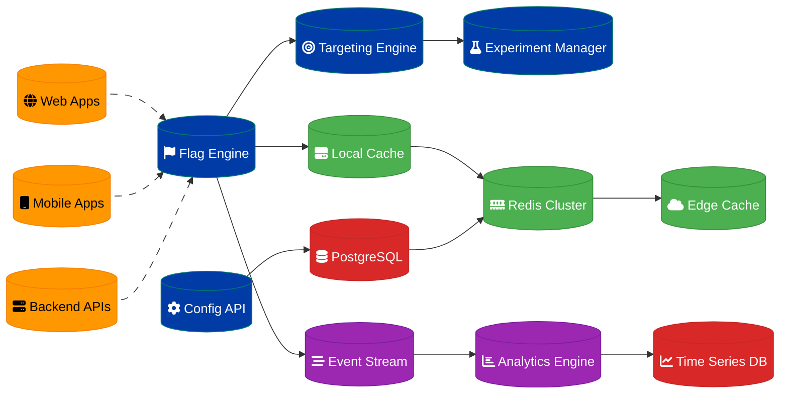

# Feature Flag Service Design

## Overview

A high-performance feature flag service supporting A/B testing for 20 million users with sub-100ms latency requirements, enabling safe feature rollouts and experimentation.

## Architecture Components

### Flag Management Core
- **Flag Engine**: Feature flag evaluation logic
- **Experiment Manager**: A/B test configuration and tracking
- **Targeting Engine**: User segmentation and targeting rules
- **Configuration API**: Flag management interface

### Caching & Performance
- **Redis Cluster**: Multi-layer caching strategy
- **Edge Caching**: CDN-based flag distribution
- **Local Caching**: Application-level flag caching
- **Cache Invalidation**: Real-time flag updates

### Analytics & Reporting
- **Event Tracking**: Flag evaluation analytics
- **Experiment Analytics**: A/B test result analysis
- **Performance Monitoring**: Latency and error tracking
- **Business Metrics**: Conversion and engagement tracking

## Data Flow Architecture



## Feature Flag Evaluation

### Flag Types
- **Boolean Flags**: Simple on/off toggles
- **Multivariate Flags**: Multiple variant testing
- **Percentage Rollouts**: Gradual feature deployment
- **User Targeting**: Specific user/group targeting

### Evaluation Logic
```javascript
// Flag evaluation pseudocode
function evaluateFlag(flagKey, user, context) {
  const flag = getFlag(flagKey);
  
  if (!flag.enabled) return flag.defaultValue;
  
  // Check targeting rules
  if (!matchesTargeting(flag.targeting, user)) {
    return flag.defaultValue;
  }
  
  // Check experiment assignment
  if (flag.experiment) {
    return getExperimentVariant(flag.experiment, user);
  }
  
  // Check percentage rollout
  if (flag.rollout) {
    return getRolloutValue(flag.rollout, user);
  }
  
  return flag.value;
}
```

### Targeting Rules
- **User Attributes**: Demographics, location, device type
- **Behavioral Targeting**: Past actions, engagement level
- **Custom Properties**: Application-specific attributes
- **Segment Membership**: Predefined user groups

## A/B Testing Framework

### Experiment Configuration
- **Hypothesis Definition**: Clear experiment objectives
- **Variant Setup**: Control and treatment groups
- **Traffic Allocation**: Percentage-based user assignment
- **Success Metrics**: Conversion and engagement goals

### Statistical Analysis
- **Sample Size Calculation**: Statistical power analysis
- **Significance Testing**: P-value and confidence intervals
- **Effect Size Measurement**: Practical significance assessment
- **Sequential Testing**: Early stopping criteria

### Experiment Lifecycle
1. **Design Phase**: Hypothesis and metric definition
2. **Setup Phase**: Flag configuration and targeting
3. **Launch Phase**: Gradual traffic ramp-up
4. **Monitor Phase**: Real-time metric tracking
5. **Analysis Phase**: Statistical significance testing
6. **Decision Phase**: Feature rollout or rollback

## High-Performance Caching

### Multi-Layer Cache Strategy
- **L1 Cache**: Application memory (1ms latency)
- **L2 Cache**: Redis cluster (5ms latency)
- **L3 Cache**: Edge CDN (20ms latency)
- **L4 Cache**: Database (50ms latency)

### Cache Invalidation
- **Real-time Updates**: WebSocket-based cache invalidation
- **TTL Strategy**: Time-based cache expiration
- **Version-based**: Cache versioning for consistency
- **Selective Invalidation**: Targeted cache clearing

### Performance Optimization
- **Bulk Evaluation**: Multiple flag evaluation in single request
- **Precomputed Results**: Pre-calculated flag values
- **Compression**: Gzip compression for flag data
- **Connection Pooling**: Efficient Redis connections

## User Segmentation

### Segmentation Criteria
- **Geographic**: Country, region, city-based targeting
- **Demographic**: Age, gender, income-based rules
- **Behavioral**: Usage patterns, feature adoption
- **Technical**: Device type, browser, app version

### Dynamic Segmentation
- **Real-time Updates**: Live segment membership changes
- **Computed Segments**: Algorithm-based user classification
- **Lookalike Audiences**: Similar user targeting
- **Cohort Analysis**: Time-based user grouping

## Scalability Architecture

### Horizontal Scaling
- **Microservices**: Independent service scaling
- **Load Balancing**: Geographic traffic distribution
- **Database Sharding**: User-based data partitioning
- **CDN Distribution**: Global edge caching

### Performance Targets
- **Latency**: <50ms p95 for flag evaluation
- **Throughput**: 100K evaluations/second per instance
- **Availability**: 99.99% uptime SLA
- **Consistency**: <1 second flag propagation

### Capacity Planning
- **User Base**: 20 million active users
- **Evaluation Rate**: 1 billion evaluations/day
- **Flag Count**: 10,000 active flags
- **Experiment Capacity**: 1,000 concurrent experiments

## Security & Compliance

### Access Control
- **RBAC**: Role-based flag management
- **API Authentication**: JWT-based API access
- **Audit Logging**: Complete flag change history
- **Environment Isolation**: Dev/staging/prod separation

### Data Protection
- **Encryption**: TLS for data in transit
- **PII Handling**: User data anonymization
- **GDPR Compliance**: Data retention policies
- **SOC 2**: Security compliance certification

## Monitoring & Observability

### System Metrics
- **Evaluation Latency**: Flag evaluation response time
- **Cache Hit Ratio**: Cache effectiveness measurement
- **Error Rate**: Failed evaluation tracking
- **Throughput**: Evaluations per second

### Business Metrics
- **Flag Usage**: Active flag utilization
- **Experiment Performance**: A/B test effectiveness
- **Feature Adoption**: New feature uptake rates
- **Conversion Impact**: Business metric changes

### Alerting System
- **Latency Alerts**: >100ms p95 evaluation time
- **Error Rate Alerts**: >1% evaluation failures
- **Cache Miss Alerts**: <90% cache hit ratio
- **Experiment Alerts**: Statistical significance reached

## SDK & Integration

### Client SDKs
- **JavaScript**: Web and Node.js applications
- **Mobile**: iOS (Swift) and Android (Kotlin) SDKs
- **Backend**: Python, Java, Go, and .NET SDKs
- **Server-Side**: High-performance evaluation libraries

### SDK Features
- **Local Caching**: Client-side flag caching
- **Offline Support**: Cached flag evaluation
- **Real-time Updates**: WebSocket flag synchronization
- **Fallback Handling**: Graceful degradation

### Integration Patterns
- **Synchronous**: Real-time flag evaluation
- **Asynchronous**: Background flag fetching
- **Batch**: Bulk flag evaluation
- **Streaming**: Continuous flag updates

## Disaster Recovery

### High Availability
- **Multi-Region**: Cross-region deployment
- **Database Replication**: PostgreSQL streaming replication
- **Cache Redundancy**: Redis cluster failover
- **CDN Failover**: Multiple CDN providers

### Backup & Recovery
- **Configuration Backup**: Flag and experiment snapshots
- **Point-in-Time Recovery**: Historical state restoration
- **Cross-Region Sync**: Configuration replication
- **Emergency Rollback**: Rapid flag state reversion

## Implementation Roadmap

### Phase 1: Core Platform (Weeks 1-4)
1. Basic flag evaluation engine
2. PostgreSQL data model
3. Redis caching layer
4. REST API development

### Phase 2: Advanced Features (Weeks 5-8)
1. A/B testing framework
2. User targeting engine
3. Real-time cache invalidation
4. Basic analytics

### Phase 3: Performance & Scale (Weeks 9-12)
1. Multi-layer caching
2. Edge CDN integration
3. Performance optimization
4. Load testing

### Phase 4: Production Ready (Weeks 13-16)
1. SDK development
2. Monitoring and alerting
3. Security hardening
4. Documentation and training

---
**Related ADR:** [ADR 0005: Feature Flag Service](adr-0005-feature-flag-service.md)
