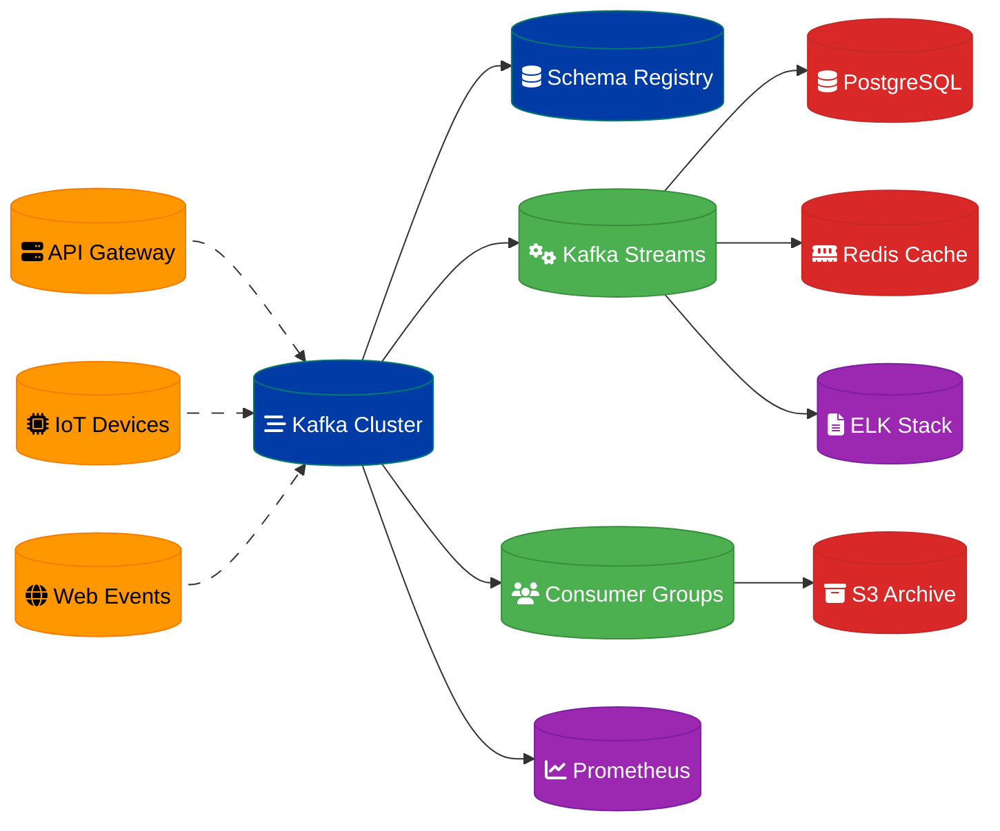

# High-Throughput Event Pipeline Design

## Overview

A horizontally scalable pipeline designed to handle millions of events per second with high availability, fault tolerance, and real-time processing capabilities.

## Architecture Components

### Event Ingestion Layer
- **Apache Kafka** clusters with multiple brokers for horizontal scaling
- **Kafka Connect** for source system integration
- **Schema Registry** for event schema management and evolution

### Stream Processing Layer
- **Apache Kafka Streams** for real-time event processing
- **Consumer Groups** for parallel processing and load distribution
- **Dead Letter Queues** for failed event handling

### Storage Layer
- **PostgreSQL** for transactional data and event metadata
- **Redis** for real-time caching and session storage
- **AWS S3** for long-term event archival and analytics

### Monitoring & Observability
- **Prometheus** for metrics collection
- **Grafana** for visualization and alerting
- **ELK Stack** for centralized logging

## Data Flow Architecture

## Scalability Strategy

### Horizontal Scaling
- **Kafka Partitioning**: Events distributed across multiple partitions based on key
- **Consumer Group Scaling**: Add/remove consumers dynamically based on load
- **Database Sharding**: Partition PostgreSQL by event type or time ranges

### Performance Optimization
- **Batch Processing**: Configure optimal batch sizes for throughput
- **Compression**: Use Snappy compression for Kafka messages
- **Connection Pooling**: Implement connection pools for database access

## Fault Tolerance

### High Availability
- **Multi-AZ Deployment**: Kafka brokers across multiple availability zones
- **Replication Factor**: Minimum 3 replicas for critical topics
- **Leader Election**: Automatic failover for partition leadership

### Error Handling
- **Retry Mechanisms**: Exponential backoff for transient failures
- **Dead Letter Topics**: Capture and analyze failed events
- **Circuit Breakers**: Prevent cascade failures in downstream systems

## Monitoring & Alerting

### Key Metrics
- **Throughput**: Events per second per topic/partition
- **Latency**: End-to-end processing time (target: <100ms p99)
- **Error Rate**: Failed events percentage (target: <0.1%)
- **Consumer Lag**: Backlog monitoring for real-time processing

### Alerting Rules
- Consumer lag > 1000 messages
- Error rate > 0.5%
- Disk usage > 80% on Kafka brokers
- Processing latency > 500ms p95

## Security Considerations

### Authentication & Authorization
- **SASL/SCRAM** for Kafka client authentication
- **ACLs** for topic-level access control
- **TLS encryption** for data in transit

### Data Protection
- **Schema validation** to prevent malformed events
- **PII masking** for sensitive data fields
- **Audit logging** for compliance requirements

## Capacity Planning

### Expected Load
- **Peak throughput**: 5 million events/second
- **Average event size**: 2KB
- **Retention period**: 7 days for hot data, 1 year archived
- **Storage requirements**: ~86TB/day raw data

### Resource Requirements
- **Kafka Cluster**: 12 brokers (c5.2xlarge)
- **Processing Layer**: 20 consumer instances (c5.large)
- **Database**: PostgreSQL cluster with read replicas
- **Cache**: Redis cluster with 64GB memory

## Implementation Phases

### Phase 1: Core Infrastructure
1. Deploy Kafka cluster with basic configuration
2. Set up PostgreSQL and Redis instances
3. Implement basic monitoring and logging

### Phase 2: Stream Processing
1. Develop Kafka Streams applications
2. Implement consumer groups for parallel processing
3. Add error handling and dead letter queues

### Phase 3: Optimization & Scaling
1. Performance tuning and load testing
2. Implement auto-scaling mechanisms
3. Add advanced monitoring and alerting

### Phase 4: Production Hardening
1. Security implementation and audit
2. Disaster recovery procedures
3. Operational runbooks and documentation

## Success Criteria

- **Throughput**: Sustain 5M events/second with linear scaling
- **Latency**: 95th percentile processing time under 100ms
- **Availability**: 99.9% uptime with automatic failover
- **Data Integrity**: Zero data loss with exactly-once processing semantics

---
**Related ADR:** [ADR 0001: Event Ingestion Pipeline](adr-0001-event-ingest-pipeline.md)
