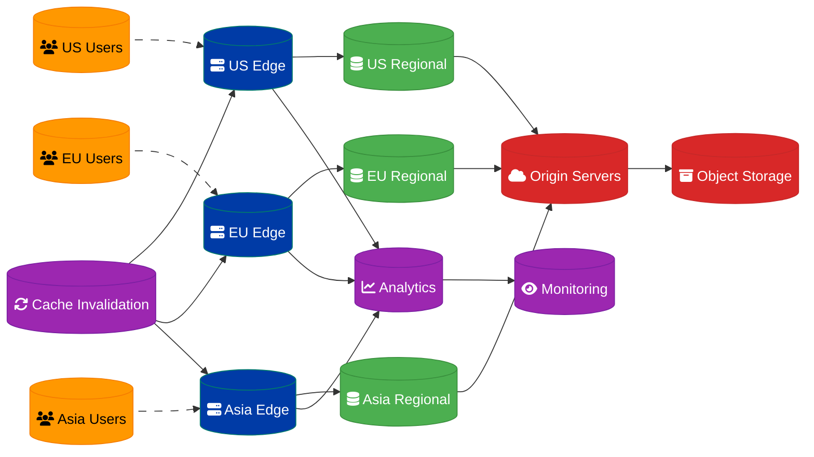

# Multi-Region Content Delivery System Design

## Overview

A multi-region content delivery system with cache invalidation strategies for a global user base of 10 million, providing low-latency content delivery and intelligent caching.

## Architecture Components

### CDN Infrastructure
- **Edge Locations**: Global point-of-presence distribution
- **Origin Servers**: Primary content source servers
- **Regional Caches**: Mid-tier caching layer
- **Load Balancers**: Traffic distribution and failover

### Cache Management
- **Cache Invalidation**: Real-time content updates
- **Cache Warming**: Proactive content preloading
- **TTL Management**: Time-based cache expiration
- **Purge Strategies**: Selective content removal

### Content Optimization
- **Compression**: Gzip/Brotli content compression
- **Image Optimization**: Dynamic image resizing and format conversion
- **Minification**: CSS/JS asset optimization
- **HTTP/2 Push**: Proactive resource delivery

## Data Flow Architecture



## Global Distribution Strategy

### Edge Location Placement
- **North America**: 15 locations (US, Canada, Mexico)
- **Europe**: 12 locations (UK, Germany, France, Netherlands, etc.)
- **Asia Pacific**: 18 locations (Japan, Singapore, Australia, India, etc.)
- **Latin America**: 8 locations (Brazil, Argentina, Chile, etc.)
- **Middle East & Africa**: 6 locations (UAE, South Africa, etc.)

### Geographic Routing
```python
class GeographicRouter:
    def __init__(self):
        self.edge_locations = {
            'us-east-1': {'lat': 39.0458, 'lon': -76.6413, 'capacity': 1000},
            'us-west-1': {'lat': 37.4419, 'lon': -122.1430, 'capacity': 1000},
            'eu-west-1': {'lat': 53.3498, 'lon': -6.2603, 'capacity': 800},
            'eu-central-1': {'lat': 50.1109, 'lon': 8.6821, 'capacity': 800},
            'ap-southeast-1': {'lat': 1.3521, 'lon': 103.8198, 'capacity': 600},
            'ap-northeast-1': {'lat': 35.6762, 'lon': 139.6503, 'capacity': 600}
        }
    
    def find_nearest_edge(self, user_lat, user_lon):
        min_distance = float('inf')
        nearest_edge = None
        
        for edge_id, location in self.edge_locations.items():
            distance = self.calculate_distance(
                user_lat, user_lon,
                location['lat'], location['lon']
            )
            
            if distance < min_distance:
                min_distance = distance
                nearest_edge = edge_id
        
        return nearest_edge, min_distance
    
    def calculate_distance(self, lat1, lon1, lat2, lon2):
        # Haversine formula for great-circle distance
        from math import radians, cos, sin, asin, sqrt
        
        lat1, lon1, lat2, lon2 = map(radians, [lat1, lon1, lat2, lon2])
        dlat = lat2 - lat1
        dlon = lon2 - lon1
        
        a = sin(dlat/2)**2 + cos(lat1) * cos(lat2) * sin(dlon/2)**2
        c = 2 * asin(sqrt(a))
        r = 6371  # Earth's radius in kilometers
        
        return c * r
```

## Cache Invalidation Strategies

### Real-Time Invalidation
```python
class CacheInvalidationManager:
    def __init__(self):
        self.edge_nodes = self.discover_edge_nodes()
        self.invalidation_queue = asyncio.Queue()
        self.batch_size = 100
        self.batch_timeout = 5  # seconds
    
    async def invalidate_content(self, content_paths, tags=None, regions=None):
        invalidation_request = {
            'id': str(uuid.uuid4()),
            'timestamp': datetime.utcnow(),
            'paths': content_paths,
            'tags': tags or [],
            'regions': regions or 'all',
            'priority': 'normal'
        }
        
        await self.invalidation_queue.put(invalidation_request)
        
        # For critical content, process immediately
        if invalidation_request.get('priority') == 'critical':
            await self.process_invalidation_immediately(invalidation_request)
    
    async def process_invalidation_batch(self):
        batch = []
        
        try:
            # Collect batch with timeout
            while len(batch) < self.batch_size:
                request = await asyncio.wait_for(
                    self.invalidation_queue.get(),
                    timeout=self.batch_timeout
                )
                batch.append(request)
        except asyncio.TimeoutError:
            pass  # Process whatever we have
        
        if batch:
            await self.execute_batch_invalidation(batch)
    
    async def execute_batch_invalidation(self, batch):
        # Group by region for efficient processing
        regional_batches = self.group_by_region(batch)
        
        tasks = []
        for region, requests in regional_batches.items():
            task = asyncio.create_task(
                self.invalidate_region(region, requests)
            )
            tasks.append(task)
        
        await asyncio.gather(*tasks, return_exceptions=True)
    
    async def invalidate_region(self, region, requests):
        edge_nodes = self.edge_nodes.get(region, [])
        
        for node in edge_nodes:
            try:
                await self.send_invalidation_to_node(node, requests)
            except Exception as e:
                logger.error(f"Failed to invalidate {node}: {e}")
                # Add to retry queue
                await self.add_to_retry_queue(node, requests)
```

### Tag-Based Invalidation
```python
class TagBasedInvalidation:
    def __init__(self):
        self.tag_mappings = {}  # tag -> set of content paths
        self.content_tags = {}  # content path -> set of tags
    
    def tag_content(self, content_path, tags):
        """Associate content with tags for efficient invalidation"""
        self.content_tags[content_path] = set(tags)
        
        for tag in tags:
            if tag not in self.tag_mappings:
                self.tag_mappings[tag] = set()
            self.tag_mappings[tag].add(content_path)
    
    async def invalidate_by_tag(self, tags):
        """Invalidate all content associated with given tags"""
        content_to_invalidate = set()
        
        for tag in tags:
            if tag in self.tag_mappings:
                content_to_invalidate.update(self.tag_mappings[tag])
        
        if content_to_invalidate:
            await self.invalidate_content(list(content_to_invalidate))
    
    def remove_content_tags(self, content_path):
        """Clean up tag mappings when content is deleted"""
        if content_path in self.content_tags:
            tags = self.content_tags[content_path]
            
            for tag in tags:
                if tag in self.tag_mappings:
                    self.tag_mappings[tag].discard(content_path)
                    
                    # Clean up empty tag mappings
                    if not self.tag_mappings[tag]:
                        del self.tag_mappings[tag]
            
            del self.content_tags[content_path]
```

## Content Optimization

### Dynamic Image Processing
```python
class ImageOptimizer:
    def __init__(self):
        self.supported_formats = ['webp', 'avif', 'jpeg', 'png']
        self.quality_settings = {
            'high': 90,
            'medium': 75,
            'low': 60
        }
    
    async def optimize_image(self, image_url, width=None, height=None, 
                           format=None, quality='medium', user_agent=None):
        # Determine optimal format based on user agent
        if not format:
            format = self.detect_optimal_format(user_agent)
        
        # Generate cache key
        cache_key = self.generate_cache_key(
            image_url, width, height, format, quality
        )
        
        # Check if optimized version exists
        cached_image = await self.get_cached_image(cache_key)
        if cached_image:
            return cached_image
        
        # Process image
        original_image = await self.fetch_original_image(image_url)
        optimized_image = await self.process_image(
            original_image, width, height, format, quality
        )
        
        # Cache optimized version
        await self.cache_image(cache_key, optimized_image)
        
        return optimized_image
    
    def detect_optimal_format(self, user_agent):
        """Detect best image format based on browser capabilities"""
        if 'Chrome' in user_agent and 'Version/9' not in user_agent:
            return 'webp'
        elif 'Firefox' in user_agent:
            return 'webp'
        elif 'Safari' in user_agent and 'Version/14' in user_agent:
            return 'webp'
        else:
            return 'jpeg'
    
    async def process_image(self, image_data, width, height, format, quality):
        """Process image with specified parameters"""
        from PIL import Image
        import io
        
        image = Image.open(io.BytesIO(image_data))
        
        # Resize if dimensions specified
        if width or height:
            image = self.smart_resize(image, width, height)
        
        # Convert format and apply quality
        output = io.BytesIO()
        
        if format == 'webp':
            image.save(output, 'WEBP', quality=self.quality_settings[quality])
        elif format == 'jpeg':
            image.save(output, 'JPEG', quality=self.quality_settings[quality])
        elif format == 'png':
            image.save(output, 'PNG', optimize=True)
        
        return output.getvalue()
```

### Asset Bundling and Minification
```python
class AssetOptimizer:
    def __init__(self):
        self.css_minifier = CSSMinifier()
        self.js_minifier = JSMinifier()
        self.bundle_cache = {}
    
    async def optimize_css_bundle(self, css_files, bundle_name):
        cache_key = f"css_bundle_{bundle_name}_{hash(tuple(css_files))}"
        
        if cache_key in self.bundle_cache:
            return self.bundle_cache[cache_key]
        
        combined_css = ""
        
        for css_file in css_files:
            css_content = await self.fetch_file_content(css_file)
            # Process imports and resolve relative URLs
            processed_css = await self.process_css_imports(css_content, css_file)
            combined_css += processed_css + "\n"
        
        # Minify combined CSS
        minified_css = self.css_minifier.minify(combined_css)
        
        # Add source map for debugging
        source_map = self.generate_css_source_map(css_files, minified_css)
        
        bundle_result = {
            'content': minified_css,
            'source_map': source_map,
            'size': len(minified_css),
            'original_size': len(combined_css),
            'compression_ratio': len(minified_css) / len(combined_css)
        }
        
        self.bundle_cache[cache_key] = bundle_result
        return bundle_result
    
    async def optimize_js_bundle(self, js_files, bundle_name):
        # Similar implementation for JavaScript bundling
        # Include tree shaking, dead code elimination
        pass
```

## Performance Monitoring

### Real-Time Analytics
```python
class CDNAnalytics:
    def __init__(self):
        self.metrics_collector = MetricsCollector()
        self.real_time_dashboard = RealTimeDashboard()
    
    async def track_request(self, request_data):
        metrics = {
            'timestamp': datetime.utcnow(),
            'edge_location': request_data['edge_location'],
            'user_country': request_data['user_country'],
            'content_type': request_data['content_type'],
            'cache_status': request_data['cache_status'],  # HIT, MISS, STALE
            'response_time': request_data['response_time'],
            'bytes_transferred': request_data['bytes_transferred'],
            'status_code': request_data['status_code'],
            'user_agent': request_data['user_agent']
        }
        
        await self.metrics_collector.record(metrics)
        await self.update_real_time_metrics(metrics)
    
    async def calculate_performance_metrics(self):
        """Calculate key performance indicators"""
        return {
            'cache_hit_ratio': await self.calculate_cache_hit_ratio(),
            'average_response_time': await self.calculate_avg_response_time(),
            'bandwidth_usage': await self.calculate_bandwidth_usage(),
            'error_rate': await self.calculate_error_rate(),
            'top_content': await self.get_top_requested_content(),
            'geographic_distribution': await self.get_geographic_stats()
        }
    
    async def detect_anomalies(self):
        """Detect unusual traffic patterns or performance issues"""
        current_metrics = await self.get_current_metrics()
        historical_baseline = await self.get_historical_baseline()
        
        anomalies = []
        
        # Check for unusual traffic spikes
        if current_metrics['requests_per_second'] > historical_baseline['requests_per_second'] * 3:
            anomalies.append({
                'type': 'traffic_spike',
                'severity': 'high',
                'current_value': current_metrics['requests_per_second'],
                'baseline': historical_baseline['requests_per_second']
            })
        
        # Check for cache hit ratio degradation
        if current_metrics['cache_hit_ratio'] < historical_baseline['cache_hit_ratio'] * 0.8:
            anomalies.append({
                'type': 'cache_degradation',
                'severity': 'medium',
                'current_value': current_metrics['cache_hit_ratio'],
                'baseline': historical_baseline['cache_hit_ratio']
            })
        
        return anomalies
```

## Security & DDoS Protection

### Edge Security
```python
class EdgeSecurity:
    def __init__(self):
        self.rate_limiter = RateLimiter()
        self.geo_blocker = GeoBlocker()
        self.bot_detector = BotDetector()
    
    async def security_check(self, request):
        """Comprehensive security validation at edge"""
        
        # Rate limiting
        if not await self.rate_limiter.allow_request(
            request.client_ip, 
            request.path
        ):
            return SecurityResponse.RATE_LIMITED
        
        # Geographic restrictions
        if await self.geo_blocker.is_blocked_country(request.country):
            return SecurityResponse.GEO_BLOCKED
        
        # Bot detection
        bot_score = await self.bot_detector.analyze_request(request)
        if bot_score > 0.8:  # High probability of bot
            return SecurityResponse.BOT_CHALLENGE
        
        # WAF rules
        if await self.check_waf_rules(request):
            return SecurityResponse.WAF_BLOCKED
        
        return SecurityResponse.ALLOWED
    
    async def handle_ddos_attack(self, attack_signature):
        """Automated DDoS mitigation"""
        
        # Implement rate limiting
        await self.rate_limiter.enable_emergency_mode()
        
        # Block suspicious IPs
        await self.block_attack_sources(attack_signature['source_ips'])
        
        # Enable CAPTCHA challenges
        await self.enable_captcha_challenges(attack_signature['patterns'])
        
        # Scale up edge capacity
        await self.auto_scale_edge_nodes(attack_signature['affected_regions'])
        
        # Notify security team
        await self.send_security_alert(attack_signature)
```

## Cost Optimization

### Intelligent Caching
```python
class CostOptimizedCaching:
    def __init__(self):
        self.popularity_tracker = PopularityTracker()
        self.cost_calculator = CostCalculator()
    
    async def optimize_cache_strategy(self):
        """Optimize caching based on cost-benefit analysis"""
        
        content_analytics = await self.analyze_content_performance()
        
        for content_item in content_analytics:
            # Calculate cost-benefit ratio
            cache_cost = self.cost_calculator.calculate_cache_cost(
                content_item['size'],
                content_item['regions']
            )
            
            origin_cost = self.cost_calculator.calculate_origin_cost(
                content_item['requests'],
                content_item['bandwidth']
            )
            
            cost_benefit_ratio = origin_cost / cache_cost
            
            # Adjust caching strategy
            if cost_benefit_ratio > 2.0:
                # High benefit, cache aggressively
                await self.set_cache_policy(content_item['path'], {
                    'ttl': 86400,  # 24 hours
                    'regions': 'all',
                    'priority': 'high'
                })
            elif cost_benefit_ratio < 0.5:
                # Low benefit, minimal caching
                await self.set_cache_policy(content_item['path'], {
                    'ttl': 3600,   # 1 hour
                    'regions': 'popular_only',
                    'priority': 'low'
                })
```

## Implementation Timeline

### Phase 1: Core Infrastructure (Weeks 1-4)
1. Edge location deployment
2. Basic caching implementation
3. Origin server setup
4. Load balancer configuration

### Phase 2: Advanced Caching (Weeks 5-8)
1. Cache invalidation system
2. Tag-based invalidation
3. Content optimization
4. Performance monitoring

### Phase 3: Global Optimization (Weeks 9-12)
1. Geographic routing optimization
2. Cost optimization algorithms
3. Security implementation
4. Advanced analytics

### Phase 4: Production Ready (Weeks 13-16)
1. DDoS protection
2. Disaster recovery
3. Comprehensive monitoring
4. Documentation and training

## Success Criteria

- **Global Coverage**: <100ms latency for 95% of users worldwide
- **Cache Efficiency**: >90% cache hit ratio for static content
- **Availability**: 99.99% uptime across all regions
- **Scalability**: Handle 10M concurrent users with linear scaling

---
**Related ADR:** [ADR 0010: Multi-Region CDN](docs/adr-0010-multi-region-cdn.md)
