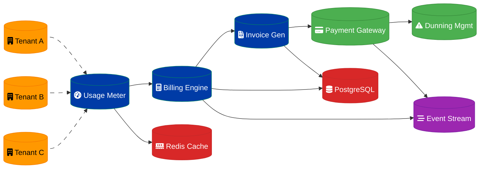

# Multi-Tenant Billing System Design

## Overview

A comprehensive billing system supporting subscription, usage-based, and freemium monetization models with eventual consistency across multiple tenants and billing cycles.

## Architecture Components

### Billing Engine Core
- **Subscription Management**: Recurring billing cycles and plan management
- **Usage Tracking**: Real-time metering and aggregation
- **Invoice Generation**: Automated billing with multiple payment methods
- **Revenue Recognition**: Compliance with accounting standards

### Multi-Tenancy Layer
- **Tenant Isolation**: Data segregation and security boundaries
- **Plan Customization**: Tenant-specific pricing and features
- **Resource Quotas**: Usage limits and throttling per tenant

### Payment Processing
- **Payment Gateway Integration**: Stripe, PayPal, and bank transfers
- **Dunning Management**: Failed payment retry logic
- **Tax Calculation**: Geographic tax compliance
- **Currency Support**: Multi-currency billing and conversion

## Data Flow Architecture

## Billing Models

### Subscription Model
- **Fixed Plans**: Monthly/annual recurring charges
- **Tiered Pricing**: Feature-based plan differentiation
- **Add-ons**: Optional services and upgrades
- **Proration**: Mid-cycle plan changes and adjustments

### Usage-Based Model
- **Metered Billing**: Pay-per-use consumption tracking
- **Volume Discounts**: Graduated pricing tiers
- **Overage Charges**: Exceeding plan limits
- **Minimum Commitments**: Guaranteed monthly minimums

### Freemium Model
- **Free Tier Limits**: Usage quotas and feature restrictions
- **Conversion Tracking**: Free-to-paid upgrade analytics
- **Trial Periods**: Time-limited full access
- **Feature Gating**: Premium feature access control

## Multi-Tenant Architecture

### Data Isolation Strategies
- **Schema-per-Tenant**: Dedicated database schemas
- **Row-Level Security**: Tenant ID filtering
- **Encrypted Storage**: Tenant-specific encryption keys
- **Audit Trails**: Per-tenant activity logging

### Tenant Configuration
- **Custom Pricing**: Tenant-specific rates and discounts
- **Billing Cycles**: Flexible billing periods
- **Currency Preferences**: Multi-currency support
- **Tax Settings**: Geographic tax configuration

## Eventual Consistency Model

### Event-Driven Architecture
- **Usage Events**: Real-time consumption tracking
- **Billing Events**: Invoice generation triggers
- **Payment Events**: Transaction status updates
- **Reconciliation**: Periodic consistency checks

### Consistency Guarantees
- **Eventually Consistent**: Usage aggregation within 5 minutes
- **Strong Consistency**: Payment transactions and account balances
- **Compensating Actions**: Rollback mechanisms for failures
- **Idempotency**: Duplicate event handling

## Payment Processing

### Gateway Integration
- **Primary Gateway**: Stripe for card processing
- **Backup Gateway**: PayPal for redundancy
- **Bank Transfers**: ACH and wire transfer support
- **Cryptocurrency**: Bitcoin and Ethereum acceptance

### Dunning Management
- **Retry Logic**: Exponential backoff for failed payments
- **Grace Periods**: Account suspension delays
- **Notification System**: Email and webhook alerts
- **Recovery Workflows**: Automated collection processes

## Tax Compliance

### Geographic Tax Handling
- **VAT**: European Union tax calculation
- **Sales Tax**: US state-level tax rates
- **GST**: Goods and Services Tax for applicable regions
- **Tax Exemptions**: Non-profit and enterprise exemptions

### Compliance Features
- **Tax Reporting**: Automated tax document generation
- **Audit Trails**: Complete transaction history
- **Regulatory Updates**: Automatic tax rate updates
- **Invoice Requirements**: Compliant invoice formatting

## Performance & Scalability

### Horizontal Scaling
- **Microservices**: Independent billing service scaling
- **Database Sharding**: Tenant-based data partitioning
- **Caching Strategy**: Redis for frequently accessed data
- **CDN Integration**: Global invoice delivery

### Performance Targets
- **Usage Ingestion**: 100K events/second
- **Billing Calculation**: <2 seconds for complex invoices
- **Payment Processing**: <5 seconds end-to-end
- **Report Generation**: <30 seconds for monthly reports

## Security & Compliance

### Data Protection
- **PCI DSS**: Payment card data security
- **GDPR**: European data protection compliance
- **SOX**: Financial reporting controls
- **Encryption**: AES-256 for data at rest

### Access Control
- **RBAC**: Role-based access control
- **API Authentication**: JWT tokens and API keys
- **Audit Logging**: Complete access trail
- **Rate Limiting**: API abuse prevention

## Monitoring & Analytics

### Key Metrics
- **Revenue Recognition**: Real-time revenue tracking
- **Churn Analysis**: Subscription cancellation patterns
- **Payment Success Rate**: Transaction completion rates
- **Usage Patterns**: Consumption trend analysis

### Business Intelligence
- **Revenue Dashboards**: Executive reporting
- **Cohort Analysis**: Customer lifetime value
- **Forecasting**: Predictive revenue modeling
- **A/B Testing**: Pricing optimization experiments

## Implementation Strategy

### Phase 1: Core Billing
1. Basic subscription management
2. Simple usage tracking
3. Stripe payment integration
4. PostgreSQL data model

### Phase 2: Multi-Tenancy
1. Tenant isolation implementation
2. Custom pricing configuration
3. Multi-currency support
4. Tax calculation engine

### Phase 3: Advanced Features
1. Complex billing models
2. Dunning management
3. Revenue recognition
4. Advanced analytics

### Phase 4: Scale & Optimize
1. Performance optimization
2. Global deployment
3. Advanced security features
4. Compliance certifications

---
**Related ADR:** [ADR 0002: Multi-Tenant Billing System](adr-0002-multi-tenant-billing.md)
