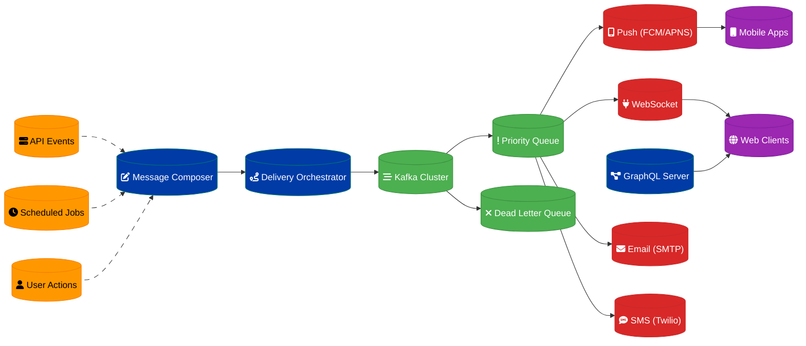

# Real-Time Notification System Design

## Overview

A scalable real-time notification delivery system handling 5 million push notifications with GraphQL subscriptions and message queuing for multi-channel communication.

## Architecture Components

### Notification Engine
- **Message Composer**: Template-based notification creation
- **Delivery Orchestrator**: Multi-channel routing logic
- **Subscription Manager**: GraphQL subscription handling
- **Preference Engine**: User notification preferences

### Message Queuing
- **Apache Kafka**: High-throughput message streaming
- **Priority Queues**: Urgent vs. standard notification handling
- **Dead Letter Queues**: Failed delivery management
- **Message Deduplication**: Duplicate notification prevention

### Delivery Channels
- **Push Notifications**: Mobile app notifications (FCM/APNS)
- **WebSocket**: Real-time web notifications
- **Email**: SMTP-based email delivery
- **SMS**: Twilio integration for text messages

## Data Flow Architecture



## GraphQL Subscription Architecture

### Real-Time Subscriptions
- **WebSocket Transport**: Persistent connection management
- **Subscription Filtering**: User-specific notification streams
- **Connection Scaling**: Horizontal WebSocket server scaling
- **Authentication**: JWT-based subscription authorization

### Subscription Types
```graphql
type Subscription {
  notifications(userId: ID!): Notification
  systemAlerts: SystemAlert
  chatMessages(channelId: ID!): ChatMessage
  orderUpdates(orderId: ID!): OrderStatus
}

type Notification {
  id: ID!
  type: NotificationType!
  title: String!
  message: String!
  timestamp: DateTime!
  metadata: JSON
}
```

### Connection Management
- **Connection Pooling**: Efficient WebSocket handling
- **Heartbeat Monitoring**: Connection health checks
- **Graceful Degradation**: Fallback to polling
- **Rate Limiting**: Subscription abuse prevention

## Message Queuing Strategy

### Kafka Topic Design
- **Notification Events**: Primary notification stream
- **Priority Topics**: Urgent notification handling
- **Channel-Specific**: Separate topics per delivery channel
- **Dead Letter Topics**: Failed delivery tracking

### Queue Processing
- **Consumer Groups**: Parallel message processing
- **Batch Processing**: Efficient bulk operations
- **Retry Logic**: Exponential backoff for failures
- **Ordering Guarantees**: Per-user message ordering

### Message Prioritization
- **Critical**: Security alerts, system failures
- **High**: Transaction confirmations, urgent updates
- **Normal**: General notifications, marketing
- **Low**: Digest emails, periodic summaries

## Multi-Channel Delivery

### Push Notifications
- **FCM Integration**: Android device targeting
- **APNS Integration**: iOS device targeting
- **Badge Management**: App icon badge updates
- **Rich Notifications**: Images, actions, and deep links

### Email Delivery
- **SMTP Configuration**: Multiple provider support
- **Template Engine**: HTML/text email templates
- **Bounce Handling**: Invalid email management
- **Unsubscribe Management**: Preference handling

### SMS Integration
- **Twilio API**: Reliable SMS delivery
- **International Support**: Global phone number handling
- **Delivery Receipts**: Message status tracking
- **Opt-out Management**: SMS preference compliance

### WebSocket Notifications
- **Real-time Delivery**: Instant web notifications
- **Browser Notifications**: Native browser API integration
- **Fallback Mechanisms**: Polling for connection issues
- **Message Persistence**: Offline message queuing

## User Preference Management

### Notification Preferences
- **Channel Selection**: User-preferred delivery methods
- **Frequency Control**: Notification timing preferences
- **Category Filtering**: Topic-based notification control
- **Do Not Disturb**: Time-based notification blocking

### Preference Storage
- **User Profiles**: PostgreSQL preference storage
- **Cache Layer**: Redis for fast preference lookup
- **Default Settings**: System-wide preference defaults
- **Preference Inheritance**: Group-based settings

## Scalability & Performance

### Horizontal Scaling
- **Microservices**: Independent service scaling
- **Load Balancing**: Traffic distribution across instances
- **Database Sharding**: User-based data partitioning
- **CDN Integration**: Global content delivery

### Performance Optimization
- **Connection Pooling**: Efficient resource utilization
- **Batch Operations**: Bulk notification processing
- **Caching Strategy**: Frequently accessed data caching
- **Async Processing**: Non-blocking operations

### Capacity Planning
- **Peak Load**: 5M notifications/day (58 notifications/second average)
- **Burst Capacity**: 1000 notifications/second peak
- **Storage Requirements**: 30-day notification history
- **Connection Limits**: 100K concurrent WebSocket connections

## Reliability & Fault Tolerance

### High Availability
- **Multi-AZ Deployment**: Cross-zone redundancy
- **Service Redundancy**: Multiple instance deployment
- **Database Clustering**: PostgreSQL high availability
- **Message Durability**: Kafka replication

### Error Handling
- **Retry Mechanisms**: Intelligent retry strategies
- **Circuit Breakers**: Cascade failure prevention
- **Graceful Degradation**: Partial service functionality
- **Monitoring & Alerting**: Proactive issue detection

### Delivery Guarantees
- **At-Least-Once**: Guaranteed message delivery
- **Idempotency**: Duplicate message handling
- **Delivery Tracking**: End-to-end status monitoring
- **Failure Recovery**: Automatic retry and escalation

## Security & Privacy

### Authentication & Authorization
- **JWT Tokens**: Secure API access
- **OAuth 2.0**: Third-party integration security
- **Role-Based Access**: Permission-based notification access
- **API Rate Limiting**: Abuse prevention

### Data Protection
- **Encryption**: TLS for data in transit
- **PII Handling**: Personal data protection
- **GDPR Compliance**: European privacy regulations
- **Data Retention**: Automatic data purging

## Monitoring & Analytics

### System Metrics
- **Delivery Rate**: Successful notification percentage
- **Latency**: End-to-end delivery time
- **Error Rate**: Failed delivery tracking
- **Connection Health**: WebSocket connection monitoring

### Business Metrics
- **Engagement Rate**: Notification interaction tracking
- **Channel Effectiveness**: Delivery method performance
- **User Preferences**: Preference change analytics
- **A/B Testing**: Notification optimization experiments

### Alerting Rules
- **Delivery failure rate > 5%**
- **Average latency > 10 seconds**
- **Queue depth > 10,000 messages**
- **WebSocket connection drops > 100/minute**

## Implementation Timeline

### Phase 1: Core Infrastructure (Weeks 1-3)
1. Kafka cluster setup
2. Basic notification engine
3. PostgreSQL schema design
4. GraphQL server implementation

### Phase 2: Channel Integration (Weeks 4-6)
1. Push notification integration (FCM/APNS)
2. Email delivery system
3. SMS integration (Twilio)
4. WebSocket notification delivery

### Phase 3: Advanced Features (Weeks 7-9)
1. User preference management
2. Message prioritization
3. Template engine
4. Delivery tracking

### Phase 4: Scale & Monitor (Weeks 10-12)
1. Performance optimization
2. Monitoring and alerting
3. Load testing
4. Security hardening

---
**Related ADR:** [ADR 0004: Real-Time Notification System](adr-0004-real-time-notification.md)
