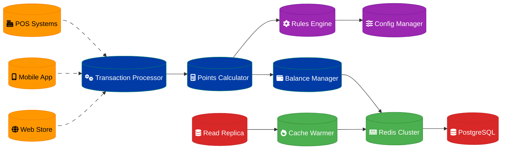

# Rewards Calculation Engine Design

## Overview

A high-performance rewards calculation engine processing 10 million transactions daily through Redis write-through cache to PostgreSQL, supporting complex reward rules and real-time point calculations.

## Architecture Components

### Calculation Engine Core
- **Rules Engine**: Configurable reward calculation logic
- **Transaction Processor**: Real-time transaction ingestion
- **Points Calculator**: Multi-tier reward computation
- **Balance Manager**: Account balance tracking and updates

### Caching Layer
- **Redis Cluster**: Write-through cache for hot data
- **Cache Warming**: Proactive data preloading
- **Invalidation Strategy**: Smart cache eviction policies
- **Consistency Management**: Cache-database synchronization

### Data Storage
- **PostgreSQL**: Primary transactional data store
- **Read Replicas**: Query load distribution
- **Partitioning**: Time-based transaction partitioning
- **Archival**: Historical data management

## Data Flow Architecture

## Reward Calculation Models

### Points-Based Rewards
- **Base Rate**: Standard points per dollar spent
- **Category Multipliers**: Enhanced rates for specific categories
- **Promotional Bonuses**: Time-limited multiplier campaigns
- **Tier Benefits**: Loyalty level-based multipliers

### Cashback Rewards
- **Percentage-Based**: Fixed percentage of transaction amount
- **Flat Rate**: Fixed amount per transaction
- **Tiered Cashback**: Increasing rates with spending levels
- **Category Rotation**: Quarterly category bonuses

### Complex Reward Rules
- **Minimum Thresholds**: Spending requirements for rewards
- **Maximum Caps**: Monthly/annual earning limits
- **Exclusions**: Non-qualifying transaction types
- **Expiration**: Time-based point expiration policies

## Caching Strategy

### Write-Through Cache Pattern
- **Immediate Consistency**: Cache updated with database writes
- **Read Performance**: Sub-millisecond cache lookups
- **Fault Tolerance**: Database as source of truth
- **Cache Warming**: Proactive data loading

### Cache Data Structure
- **User Balances**: Current point/cashback balances
- **Transaction History**: Recent transaction cache
- **Reward Rules**: Active calculation rules
- **Account Metadata**: User tier and status information

### Cache Partitioning
- **User-Based Sharding**: Distribute by user ID hash
- **Geographic Clustering**: Regional cache clusters
- **Hot Data Identification**: Frequently accessed accounts
- **TTL Management**: Time-based cache expiration

## High-Performance Processing

### Transaction Ingestion
- **Kafka Streams**: Real-time transaction processing
- **Batch Processing**: Bulk transaction imports
- **Deduplication**: Duplicate transaction detection
- **Validation**: Transaction integrity checks

### Parallel Processing
- **Worker Pools**: Concurrent calculation threads
- **Queue Management**: Priority-based processing
- **Load Balancing**: Even work distribution
- **Circuit Breakers**: Overload protection

### Performance Optimization
- **Connection Pooling**: Database connection reuse
- **Prepared Statements**: Query optimization
- **Bulk Operations**: Batch database updates
- **Async Processing**: Non-blocking operations

## Data Consistency

### ACID Compliance
- **Atomicity**: All-or-nothing transaction processing
- **Consistency**: Reward balance accuracy
- **Isolation**: Concurrent transaction handling
- **Durability**: Persistent reward records

### Eventual Consistency
- **Cache Synchronization**: Redis-PostgreSQL alignment
- **Reconciliation Jobs**: Periodic consistency checks
- **Conflict Resolution**: Handling concurrent updates
- **Audit Trails**: Complete transaction history

## Scalability Architecture

### Horizontal Scaling
- **Microservices**: Independent service scaling
- **Database Sharding**: User-based data partitioning
- **Cache Clustering**: Redis cluster expansion
- **Load Balancers**: Traffic distribution

### Vertical Scaling
- **CPU Optimization**: Multi-core processing utilization
- **Memory Management**: Efficient cache sizing
- **Storage Performance**: SSD and NVMe optimization
- **Network Bandwidth**: High-throughput connections

## Monitoring & Observability

### Performance Metrics
- **Transaction Throughput**: Transactions per second
- **Calculation Latency**: Processing time per transaction
- **Cache Hit Ratio**: Redis cache effectiveness
- **Database Performance**: Query execution times

### Business Metrics
- **Reward Accuracy**: Calculation correctness rate
- **Point Issuance**: Daily/monthly point distribution
- **Redemption Rates**: Point utilization patterns
- **Cost Analysis**: Reward program profitability

### Alerting System
- **Performance Degradation**: Latency threshold alerts
- **Error Rate Monitoring**: Failed calculation tracking
- **Cache Miss Alerts**: Cache performance issues
- **Balance Discrepancies**: Consistency violation alerts

## Security & Compliance

### Data Protection
- **Encryption**: AES-256 for sensitive data
- **Access Control**: Role-based permissions
- **Audit Logging**: Complete activity tracking
- **PCI Compliance**: Payment data security

### Fraud Prevention
- **Anomaly Detection**: Unusual transaction patterns
- **Rate Limiting**: Abuse prevention mechanisms
- **Validation Rules**: Transaction authenticity checks
- **Blacklist Management**: Fraudulent account blocking

## Disaster Recovery

### Backup Strategy
- **Real-time Replication**: PostgreSQL streaming replication
- **Point-in-Time Recovery**: Transaction log backups
- **Cache Reconstruction**: Redis data rebuilding
- **Cross-Region Backups**: Geographic redundancy

### Failover Procedures
- **Automatic Failover**: Database cluster switching
- **Cache Failover**: Redis cluster redundancy
- **Service Discovery**: Dynamic endpoint updates
- **Data Validation**: Post-failover consistency checks

## Implementation Roadmap

### Phase 1: Core Engine (Weeks 1-4)
1. Basic transaction processing
2. Simple points calculation
3. PostgreSQL data model
4. Redis cache integration

### Phase 2: Advanced Features (Weeks 5-8)
1. Complex reward rules engine
2. Multi-tier calculation logic
3. Cache optimization
4. Performance tuning

### Phase 3: Scale & Monitor (Weeks 9-12)
1. Horizontal scaling implementation
2. Comprehensive monitoring
3. Load testing and optimization
4. Security hardening

### Phase 4: Production Ready (Weeks 13-16)
1. Disaster recovery setup
2. Compliance validation
3. Documentation completion
4. Operational procedures

## Success Criteria

- **Throughput**: Process 10M transactions/day (115 TPS average, 1000 TPS peak)
- **Latency**: <50ms p95 for reward calculations
- **Accuracy**: 99.99% calculation correctness
- **Availability**: 99.9% uptime with <1 minute failover

---
**Related ADR:** [ADR 0003: Rewards Calculation Engine](adr-0003-rewards-calculation-engine.md)
